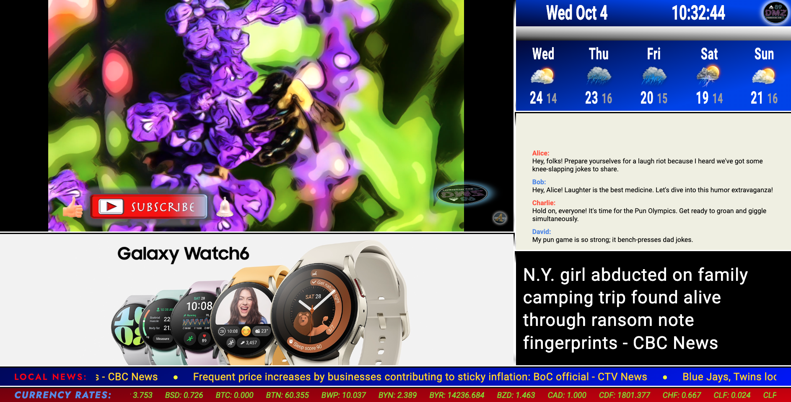
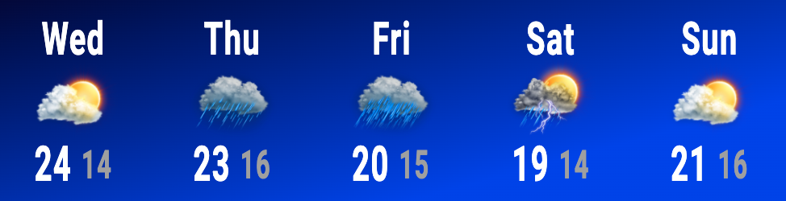

# Multifunctional Dashboard Project

This multifunctional dashboard project provides users with a comprehensive platform similar to CP24 news format. It offers a wide range of features, including real-time data such as current date and time, user's IP location, 5-day weather forecast with daily high and low temperatures, international news, current local news, currency exchange rates, YouTube video integration, advertisements, and a simulation of a social media chat section.

## Features

### 1. Real-Time Information

- **Current Date and Time:** Display the current date and time on the dashboard.

- **User's IP Location:** Retrieve and display the user's approximate location based on their IP address.

### 2. Weather Forecast

- **5-Day Weather Forecast:** Provide users with a 5-day weather forecast, including daily high and low temperatures, for their location, sourced from the WeatherAPI.

### 3. News

- **International News:** Fetch and display international news headlines from the NewsAPI.

- **Current Local News:** Present local news articles relevant to the user's location, offering a personalized news experience.

### 4. Currency Exchange Rates

- **Currency Rates:** Show real-time currency exchange rates, sourced from Fixer.io, for multiple currencies.

### 5. Multimedia Integration

- **YouTube Integration:** Embed YouTube videos relevant to the user's interests or location.

### 6. Advertisement

- **Advertisements:** Display targeted advertisements to the users.

### 7. Social Media Chat Simulation

- **Social Media Chat Section:** Create a simulated chat section that allows users to engage with the content and each other.

## Technologies Used

This project leverages the following technologies to deliver a dynamic and feature-rich dashboard:

- **HTML:** Used to structure the dashboard's layout and content.

- **CSS:** Applied for styling to ensure an appealing and user-friendly interface.

- **JavaScript:** Utilized to implement interactive features, fetch data from REST APIs, and provide real-time updates.

- **React:** Employed to build dynamic and responsive user interfaces, making the project highly modular and efficient.

## Usage

To run the project locally or deploy it to a web server, follow these steps:

1. Clone the repository.
2. Install any necessary dependencies.
3. Set up API keys or endpoints for WeatherAPI, NewsAPI, Fixer.io, and YouTube API as required.
4. Customize the dashboard's content and styling to your preferences.
5. Launch the application and enjoy the multifunctional dashboard.

Feel free to extend the project with additional features or APIs as needed to further enhance its capabilities.

## License

This project is licensed under the MIT License - see the [LICENSE](LICENSE) file for details.
